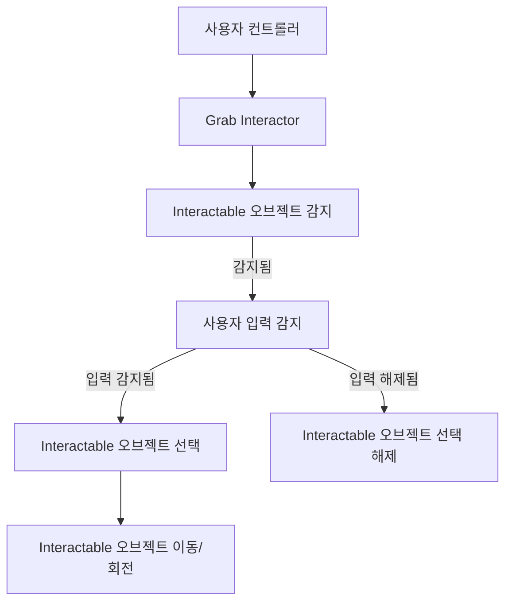
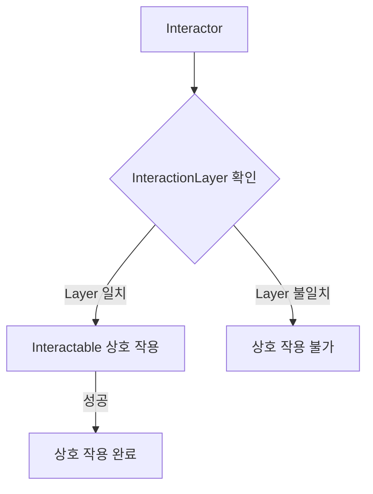

# XR Interaction Toolkit: Grab Interactor 및 Interactable 컴포넌트 소개

XR Interaction Toolkit에서 가상 환경 내 객체와 상호 작용하는 핵심 요소인 `Grab Interactor`와 `Interactable` 컴포넌트에 대해 설명합니다. 이 두 컴포넌트는 사용자가 가상 오브젝트를 "잡고" 조작할 수 있도록 함께 작동합니다.

## 1. Grab Interactor

`Grab Interactor`는 컨트롤러(예: VR 컨트롤러)에 부착되어 사용자의 "잡기" 동작을 감지하고 처리하는 컴포넌트입니다. 컴포넌트 종류별로 물체 인식 방법이 다릅니다. 이는 주로 사용자의 손을 나타내는 게임 오브젝트에 추가됩니다.

### 주요 기능
- **상호 작용 감지**: 사용자가 특정 `Interactable` 오브젝트 범위 내에 있을 때 이를 감지합니다.
- **잡기 트리거**: 사용자가 특정 입력(예: 컨트롤러의 그립 버튼)을 누르면 `Interactable` 오브젝트를 잡습니다.
- **물체 조작**: 잡은 물체를 사용자의 손에 따라 이동, 회전시킵니다.

### 일반적인 설정
`Grab Interactor`는 일반적으로 `XR Ray Interactor` 또는 `XR Direct Interactor`와 함께 사용되어, 물체를 잡기 전에 먼저 물체에 "조준"하거나 "닿는" 기능을 제공합니다.

## 2. Interactable

`Interactable`은 사용자가 상호 작용할 수 있는 가상 오브젝트에 부착되는 컴포넌트입니다. 예를 들어, 잡거나 던질 수 있는 물체, 누를 수 있는 버튼 등에 사용됩니다.

### 주요 기능
- **상호 작용 가능성**: 해당 오브젝트가 `Interactor`에 의해 상호 작용될 수 있음을 나타냅니다.
- **상호 작용 이벤트**: 잡기 시작(OnSelectEntered), 잡기 종료(OnSelectExited) 등 다양한 상호 작용 이벤트를 발생시킵니다.
- **트리거 행동 제어**: `Interaction Event` 설정을 통해 잡고 있는 물체에 대한 특정 트리거 행동(예: 버튼 클릭, 특정 동작 수행)을 결정하고 사용자 정의할 수 있습니다.
- **물리적 반응**: 잡힌 후 물리적 속성(예: 중력, 충돌)을 일시적으로 비활성화하거나 수정할 수 있습니다.

### Interactable 타입 (예시)
- `XR Grab Interactable`: 가장 흔하게 사용되며, 오브젝트를 잡고 이동시킬 수 있도록 합니다.

## Grab Interactor와 Interactable의 상호 작용 흐름

다음은 `Grab Interactor`와 `Interactable`이 함께 작동하는 기본적인 흐름입니다.

## 컴포넌트 관계 요약

| 컴포넌트 | 역할 | 부착 위치 |
| :-------------- | :---------------------------------------- | :----------------- |
| `Grab Interactor` | 사용자 입력(잡기) 감지 및 물체 조작 | VR 컨트롤러 오브젝트 |
| `Interactable` | 상호 작용 가능한 물체 정의 및 이벤트 처리 | 상호 작용할 오브젝트 |

이 두 컴포넌트의 조합을 통해 XR 애플리케이션에서 직관적이고 몰입감 있는 오브젝트 조작 경험을 구현할 수 있습니다.

## 3. InteractionLayer를 통한 상호 작용 제어

`InteractionLayer`는 `Interactor`와 `Interactable` 간의 상호 작용을 필터링하고 제어하는 데 사용됩니다. 동일한 `InteractionLayer`에 속한 `Interactor`와 `Interactable`만 서로 상호 작용할 수 있습니다.

### 주요 기능
- **상호 작용 필터링**: 특정 `Interactor`가 특정 `Interactable`과만 상호 작용하도록 설정할 수 있습니다.
- **복잡한 상호 작용 구성**: 여러 `InteractionLayer`를 사용하여 다양한 상호 작용 시나리오를 만들 수 있습니다.

### InteractionLayer를 사용한 상호 작용 흐름

