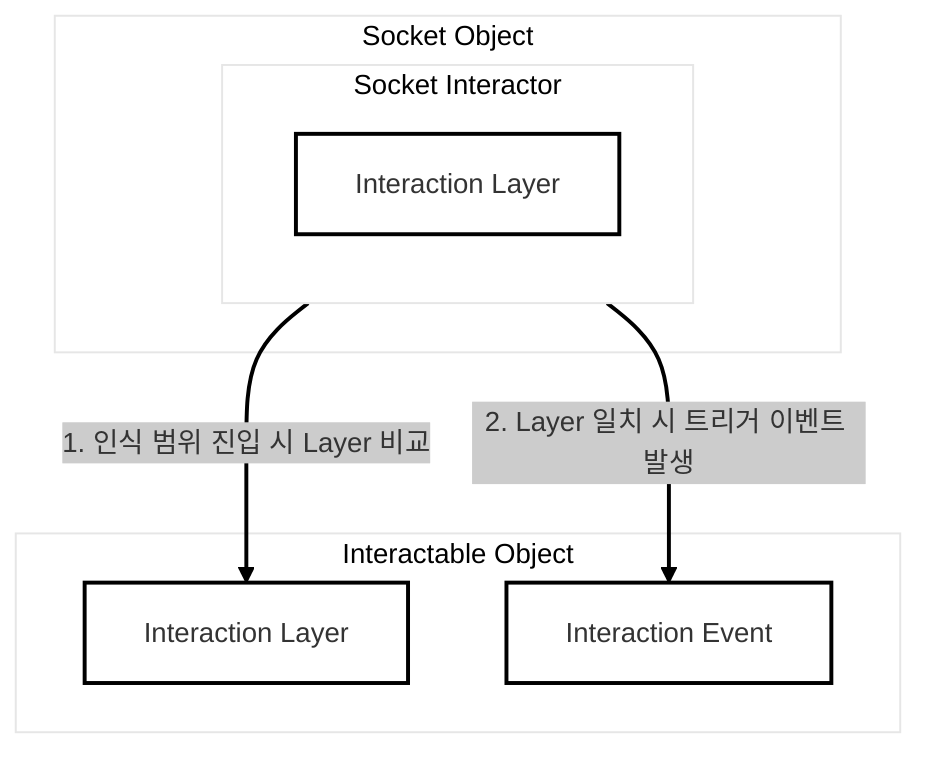
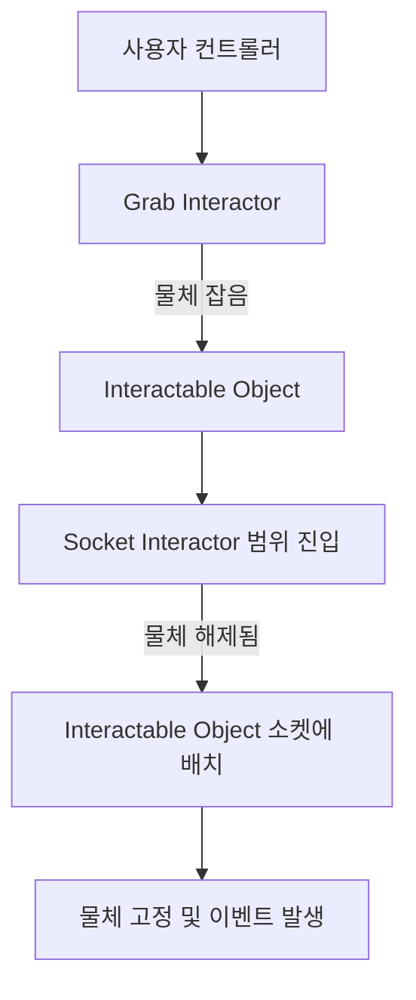
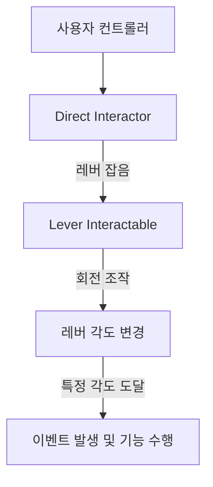

# XR Interaction Toolkit: Socket Interactor 및 Lever Interactable 컴포넌트 소개

XR Interaction Toolkit에서 특정 위치에 물체를 삽입하거나 레버를 조작하는 등 특화된 상호 작용을 구현하는 데 사용되는 `Socket Interactor`와 `Lever Interactable` 컴포넌트에 대해 설명합니다.

## 1. Socket Interactor

`Socket Interactor`는 사용자가 `Interactable` 오브젝트를 특정 슬롯이나 소켓 위치에 배치하는 동작을 감지하고 처리하는 컴포넌트입니다. 이는 주로 물체를 삽입하거나 거치할 `슬롯/소켓` 역할을 하는 게임 오브젝트에 추가됩니다.

### 주요 기능
- **물체 배치 감지**: `Interactable` 오브젝트가 소켓의 상호 작용 범위 내에 들어왔을 때를 감지합니다.
- **자동 배치**: `Interactable` 오브젝트가 소켓 범위 내에서 해제되면 자동으로 소켓 위치에 배치될 수 있습니다.
- **물체 고정**: 소켓에 배치된 `Interactable` 오브젝트를 고정시킵니다.
- **상호 작용 이벤트**: 물체 삽입(OnSelectEntered), 물체 제거(OnSelectExited) 등 이벤트를 발생시켜 특정 로직을 수행할 수 있게 합니다.

### 일반적인 설정
`Socket Interactor`는 `XR Grab Interactable`과 같은 잡기 가능한 `Interactable` 오브젝트와 함께 사용되어, 사용자가 잡은 물체를 소켓에 놓을 수 있도록 합니다.

### Socket Interactor의 상호 작용 메커니즘

`Socket Interactor`는 다음과 같은 메커니즘을 통해 `Interactable` 오브젝트와 상호 작용합니다.

1.  **Interaction Layer 비교**: `Interactable` 오브젝트가 `Socket Interactor`의 인식 범위(트리거) 안에 들어오면, `Socket Interactor`는 가장 먼저 서로의 `Interaction Layer`가 일치하는지 비교합니다. Layer가 일치하지 않으면 더 이상의 상호 작용이 일어나지 않습니다.
2.  **트리거 이벤트 발생**: `Interaction Layer`가 일치하는 `Interactable`이 소켓에 놓이면(선택되면), `Socket Interactor`는 `OnSelectEntered`와 같은 이벤트를 발생시킵니다. 개발자는 이 이벤트를 활용하여 물체가 소켓에 삽입되었을 때 실행될 특정 로직(예: 문 열기, 점수 획득)을 `Interaction Event`에 연결하여 구현할 수 있습니다.

## 2. Lever Interactable

`Lever Interactable`은 사용자가 회전시켜 조작할 수 있는 레버 형태의 상호 작용 오브젝트를 구현하는 데 사용됩니다. 이는 문 열림, 기계 작동, 스위치 전환 등 다양한 용도로 사용될 수 있습니다.

### 주요 기능
- **회전 조작**: 사용자의 손이나 컨트롤러를 통해 레버를 회전시킬 수 있도록 합니다.
- **각도 제한**: 레버가 회전할 수 있는 최소 및 최대 각도를 설정할 수 있습니다.
- **스냅 포인트**: 특정 각도에서 레버가 스냅되도록 설정하여 정확한 조작감을 제공합니다.
- **상호 작용 이벤트**: 레버가 특정 각도에 도달하거나 회전이 시작/종료될 때 이벤트를 발생시킵니다.

### 일반적인 설정
`Lever Interactable`은 일반적으로 `XR Direct Interactor`와 함께 사용되어, 사용자가 직접 손으로 레버를 잡고 돌리는 듯한 경험을 제공합니다.

## Socket Interactor와 Lever Interactable의 상호 작용 예시 흐름

### Socket Interactor 상호 작용 흐름

### Lever Interactable 상호 작용 흐름

## 컴포넌트 관계 요약

| 컴포넌트            | 역할                                            | 부착 위치          |
| :------------------ | :---------------------------------------------- | :----------------- |
| `Socket Interactor` | `Interactable` 오브젝트의 배치 및 고정          | 슬롯/소켓 오브젝트   |
| `Lever Interactable`| 회전 가능한 레버 오브젝트 구현 및 이벤트 처리   | 레버 오브젝트      |

이 두 컴포넌트를 통해 XR 환경에서 복잡하고 현실적인 상호 작용 시스템을 구축할 수 있습니다.
